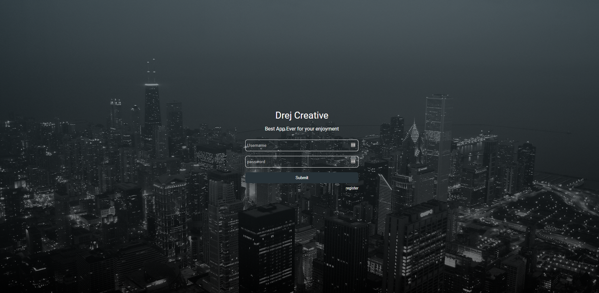

# React Redux App
[Visit App](https://react-data-dd905.firebaseapp.com)

Full Stack app. Loopback as backend with MongoDB as Database. React on Frontend with Redux for state management.

## Getting it
Run `git clone https://github.com/drejcreative/react-redux-authentification-boilerplate.git` in terminal.

Then run `npm install` to install all dependencies for loopback.
Move to `/frontend` and type `npm install` to install all react-create-app dependencies.

## Development server
Run `npm .` to start a loopback server.
Go to `/frontend` and type `npm strat` to start react app.

## Build
Go to `/frontend` and type `npm build` to build app for production. It will be compiled inside client folder.

This project was bootstrapped with [Create React App](https://github.com/facebookincubator/create-react-app).
